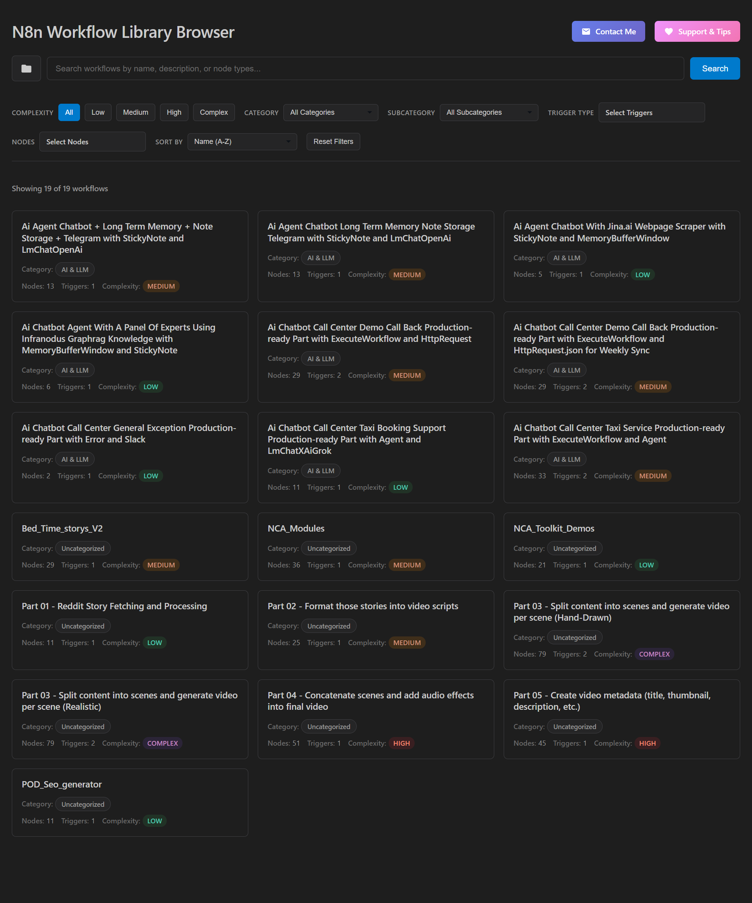
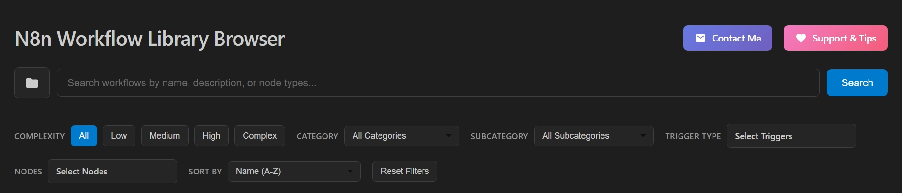
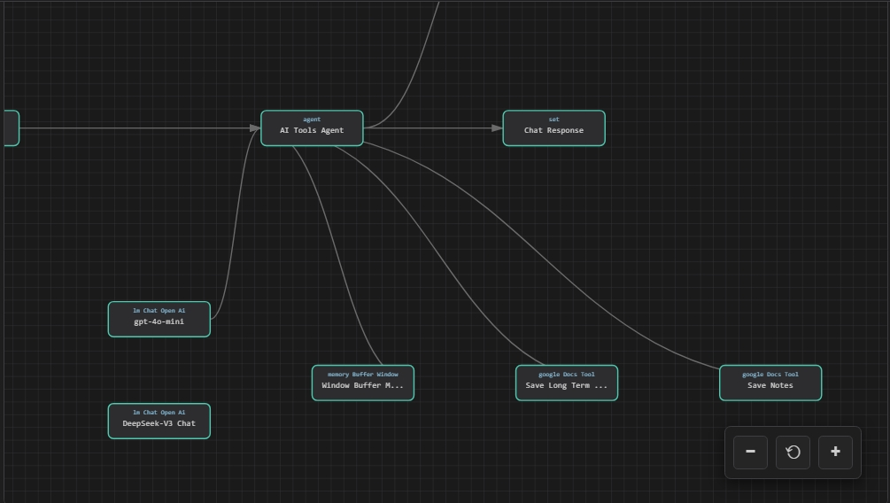

# N8n-workflow-library

This is a collection of free-to-use **10,000+ n8n workflows** that can be filtered, searched, categorized, and visualized easily using a complete browser interface.

> 💝 **Enjoying this free resource?** If you find this collection valuable, consider [buying me a coffee](https://ko-fi.com/nodeshare) to support continued development and updates!

---

---

## What exactly will you get:

#### 1. 10,000+ n8n Workflow Templates | The Ultimate Automation Library

A massive collection of **10,000+ n8n workflow templates** that will benefit your journey with n8n whether it is for learning, business, freelancing, or automation experimentation.
And it is **completely FREE**.

To get this pack all you need is to download the folder named `workflows`.

#### 2. Custom Workflow Browser Interface

Instead of manually sifting through thousands of JSON files, a powerful browser interface is provided that makes this massive collection truly usable.

The browser analyzes, categorizes, sub-categorizes, and visualizes workflows so you can find exactly what you need in seconds.

To use the browser interface, download the complete bundle from the repository.

---

## Key Features

### Smart Filtering & Search

* **Complexity-based filtering**:

  * Low (0–15 nodes)
  * Medium (16–40 nodes)
  * High (41–70 nodes)
  * Complex (70+ nodes)
  * Automated scoring based on nodes, connections, and triggers
* **Node type filtering** – Find workflows that use specific nodes (Slack, Google Sheets, HTTP Request, Airtable, Discord, Notion, and hundreds more)
* **Keyword search** – Search by workflow name OR by the nodes used inside
* **Category & Subcategory filtering** – Filter templates by both:

  * Main category (Marketing, AI, Productivity, Finance, Security, etc.)
  * Subcategory (LeadGeneration, TextGeneration, TelegramBot, DatabaseSync, InvoiceTracking, etc.)
* **Trigger filtering** – Filter templates by trigger type (Webhook, Schedule, Manual, Email, Cron, etc.)
* **Multiple sort options** – Sort by name, complexity score, node count, or date modified

---

### Workflow Intelligence

* **Complexity scoring** – Each workflow is automatically analyzed and scored
* **Node analysis** – View node count, connections, triggers, and node types before opening
* **Category & subcategory classification** – See exactly what problem the workflow solves
* **Live preview** – View complete workflow details including:

  * All node types
  * Complexity breakdown
  * Full JSON structure
* **Primitive workflow visualization** – Visually inspect the workflow structure:

  * Nodes
  * Connections between nodes
  * Flow of execution (high-level representation)

 
 

---

### Easy Export

* **One-click download** of any workflow as a JSON file
* **Copy to clipboard** for instant import into your n8n instance
* **Batch browsing with pagination** for smooth navigation through thousands of templates

---

## What's Included

The collection contains **10,000+ templates** covering almost every automation scenario imaginable:

* **AI & LLM** – Chatbots, text generation, summarization, translation, vector databases
* **Analytics & Reporting** – Log analysis, forecasting, dashboards, report generation
* **API & Integration** – API mapping, error handling, integrations
* **Communication** – Email, Slack, WhatsApp automation
* **Content Creation** – Blog generation, publishing, scheduling, image workflows
* **CRM & Sales** – Lead processing, contact sync, scoring, follow-ups
* **Data Processing** – ETL, backups, database sync, deduplication
* **DevOps & IT** – GitHub automation and infrastructure workflows
* **E-commerce** – Orders, invoices, inventory, payments, refunds
* **Finance & Payments** – Stripe, PayPal, tax reporting, fraud detection
* **Marketing** – SEO, email campaigns, lead generation, analytics
* **Productivity** – Notes, tasks, calendars, reminders, assistants
* **Security & Monitoring** – Rate limiting, incident response, compliance
* **Social Media** – Telegram, Twitter, YouTube, Instagram, Discord bots
* **Web Scraping** – Web and price scraping
* **Scheduling & Triggers** – Cron and time-based workflows

Each workflow shows:

* Node count
* Complexity score
* All node types
* Trigger nodes
* Connections and structure
* Visual flow preview

---

## Category Usage Summary

#### AI & LLM (AI)
1. Chatbot  
2. Classification  
3. Conversational Agent  
4. Image Generation  
5. Sentiment Analysis  
6. Speech To Text  
7. Summarization  
8. Text Generation  
9. Text To Speech  
10. Translation  
11. Vector DB  

#### Analytics & Reporting (ANL)
1. Dashboard Update  
2. Forecasting  
3. Log Analysis  
4. Performance Analysis  
5. Report Generation  
6. Trend Detection  

#### API & Integration (API)
1. API Data Mapping  
2. API Error Handling  

#### Communication (COMM)
1. Email Sender  
2. Slack Notifier  
3. WhatsApp Bot  

#### Content Creation (CONT)
1. Blog Generation  
2. Content Publishing  
3. Content Scheduling  
4. Image Publishing  

#### CRM & Sales (CRM)
1. Account Management  
2. Contact Sync  
3. Follow Up Automation  
4. Lead Processing  
5. Lead Scoring  

#### Data Processing (DATA)
1. Aggregation  
2. Backup  
3. Database Sync  
4. Deduplication  
5. ETL  
6. JSON Transform  
7. Restore  

#### DevOps & IT (DEV)
1. GitHub Automation  

#### E-commerce (ECOM)
1. Cart Recovery  
2. Customer Notifications  
3. Inventory Sync  
4. Invoice Generation  
5. Order Sync  
6. Payment Status Sync  
7. Price Monitoring  
8. Product Export  
9. Product Import  
10. Refund Handling  

#### Education & Research (EDU)
1. Assignment Grading  
2. Study Planning  

#### File Management (FILE)
1. File Download  
2. File Upload  

#### Finance & Payments (FIN)
1. Accounting Sync  
2. Expense Tracking  
3. Fraud Detection  
4. Invoice Tracking  
5. PayPal Integration  
6. Payment Processing  
7. Revenue Reporting  
8. Stripe Automation  
9. Tax Reporting  

#### Marketing (MKT)
1. AB Testing  
2. Conversion Tracking  
3. Customer Segmentation  
4. Email Campaign  
5. Funnel Automation  
6. Keyword Tracking  
7. Lead Generation  
8. Lead Qualification  
9. Marketing Analytics  
10. Newsletter  
11. SEO Automation  

#### Productivity (PROD)
1. Calendar Sync  
2. Knowledge Base Update  
3. Meeting Scheduling  
4. Note Sync  
5. Personal Assistant  
6. Reminder System  
7. Task Assignment  
8. Task Automation  
9. Time Tracking  
10. Workflow Manager  

#### Web Scraping (SCRAPE)
1. Price Scraping  
2. Web Scraping  

#### Security & Monitoring (SEC)
1. Audit Logging  
2. Compliance Monitoring  
3. Incident Response  
4. Rate Limit Protection  

#### Social Media (SOC)
1. Comment Monitoring  
2. Discord Bot  
3. Instagram Analytics  
4. Instagram Post  
5. LinkedIn Lead Capture  
6. LinkedIn Post  
7. Reddit Poster  
8. Social Scheduling  
9. Telegram Bot  
10. TikTok Automation  
11. Twitter Monitoring  
12. Twitter Post  
13. YouTube Uploader  

#### Scheduling & Triggers (TRIG)
1. Cron Scheduling  

---

## How to Use

1. **Download the workflows folder & interface** – Clone this repository or download the `workflows` folder
2. **Launch the browser** – Run the browser interface
3. **Filter by category & subcategory** – Narrow results to your exact use case
4. **Preview and visualize** – Inspect nodes, connections, and workflow flow
5. **Download or copy** – Export JSON or copy directly
6. **Import into n8n** – Paste or import into your n8n instance

---

## Bonus: Use With Your Own Templates

The workflow browser works with **any collection of n8n workflows**:

* Point it to your own workflow folder
* Automatic parsing and analysis
* Metadata extraction (nodes, triggers, complexity)
* Category & subcategory classification
* Primitive visualization of node connections
* Full search and filtering

Ideal for teams, agencies, and automation libraries.

---

## Who Is This For?

* Beginners
* Businesses
* Freelancers
* Automation enthusiasts
* Teams
* Developers

---

## Getting Started

1. Clone or download this repository
2. Explore the workflows folder or browser interface
3. Filter by category and subcategory
4. Visualize and inspect workflows
5. Import into n8n
6. Customize for your use case

---

## License

This repository serves as an archive of publicly available workflows from **n8n.io/workflows**. All workflows maintain their original licensing terms. Please consult individual workflow metadata for specific license details.
The archival tooling and repository organization are released under the **MIT License**.

If you are the original author of any workflow and wish for it to be removed, please open an issue and it will be promptly addressed.

---

## Disclaimer

This is an independent project with no official affiliation to n8n.
It represents a personal effort to improve accessibility and long-term preservation of publicly shared n8n workflows.

This repository contains ONLY free, publicly available community templates from n8n.io/workflows.
No paid or premium marketplace content is included.

---

## Support

If you find this collection helpful, please star this repository and share it with others who might benefit from it.
If you find this collection valuable, consider [buying me a coffee](https://ko-fi.com/nodeshare).
